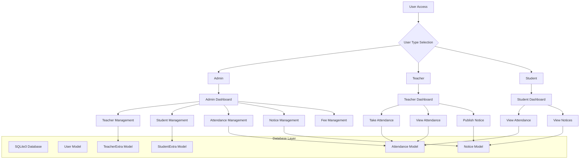
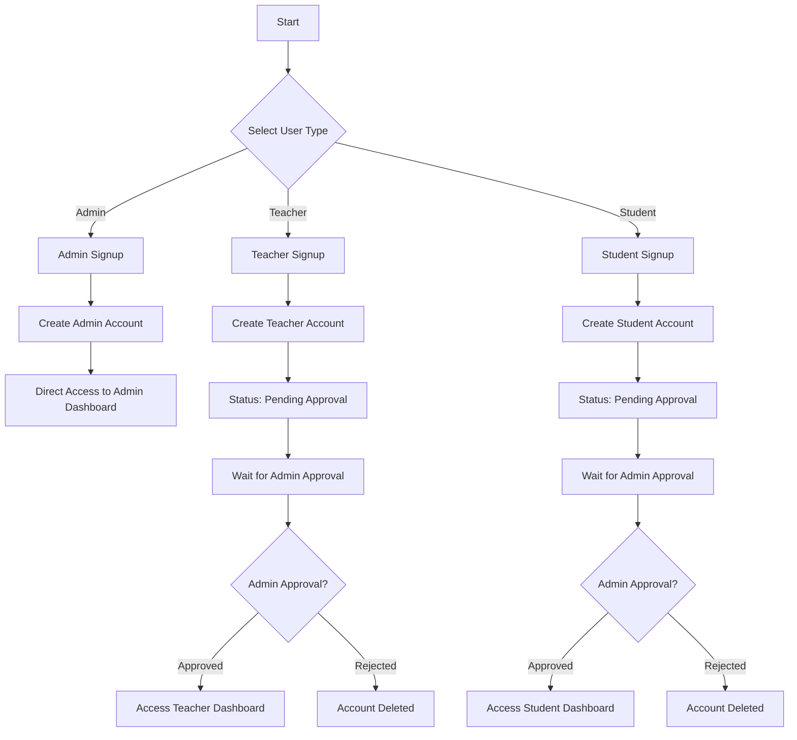
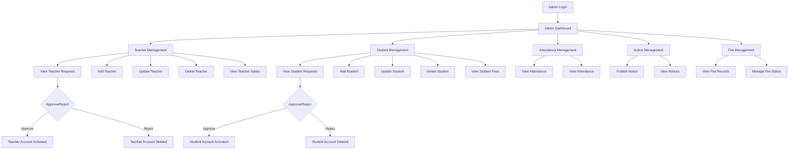
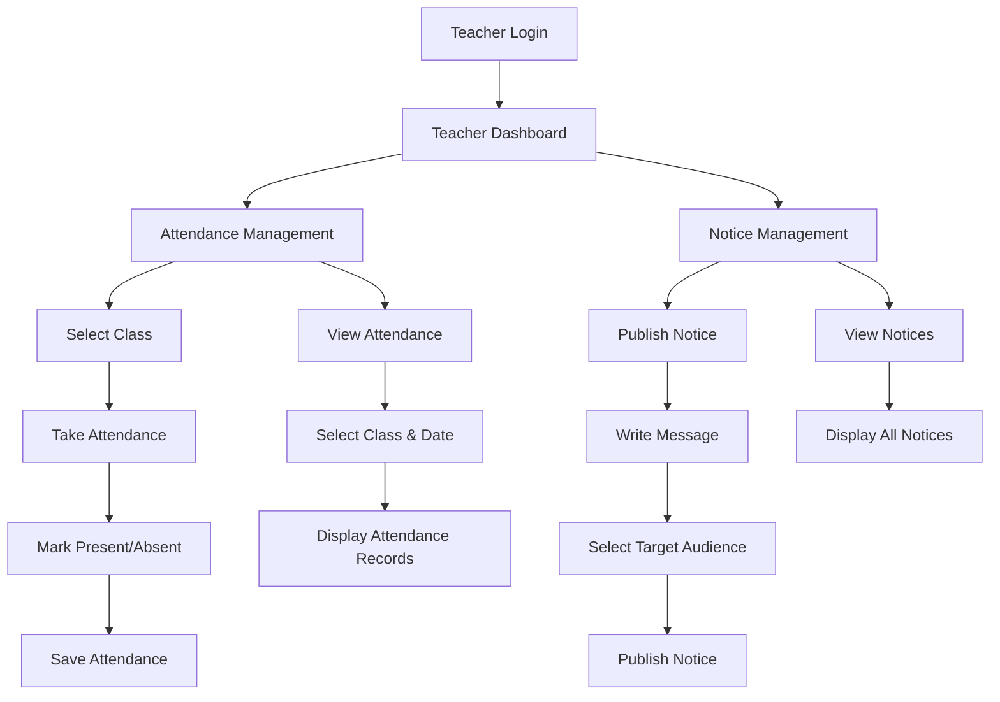
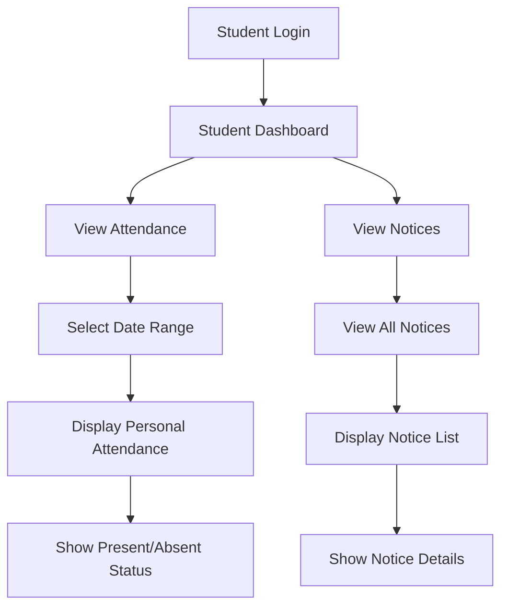
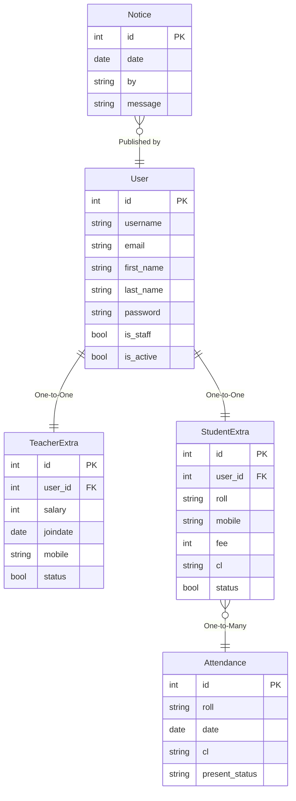
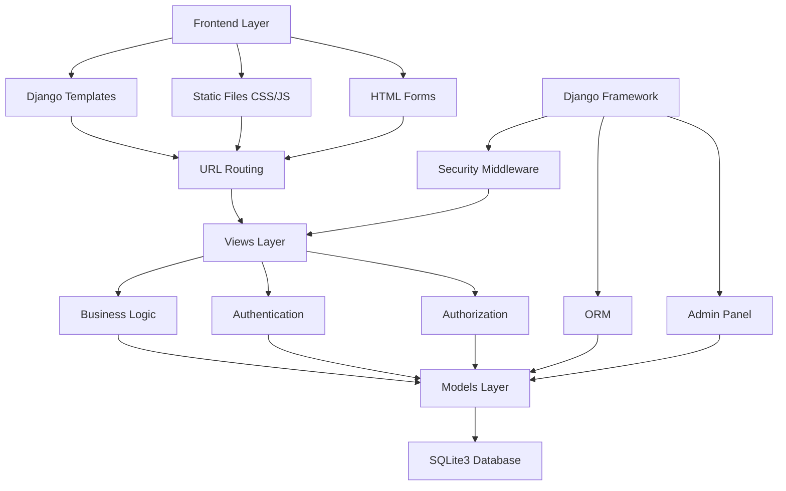
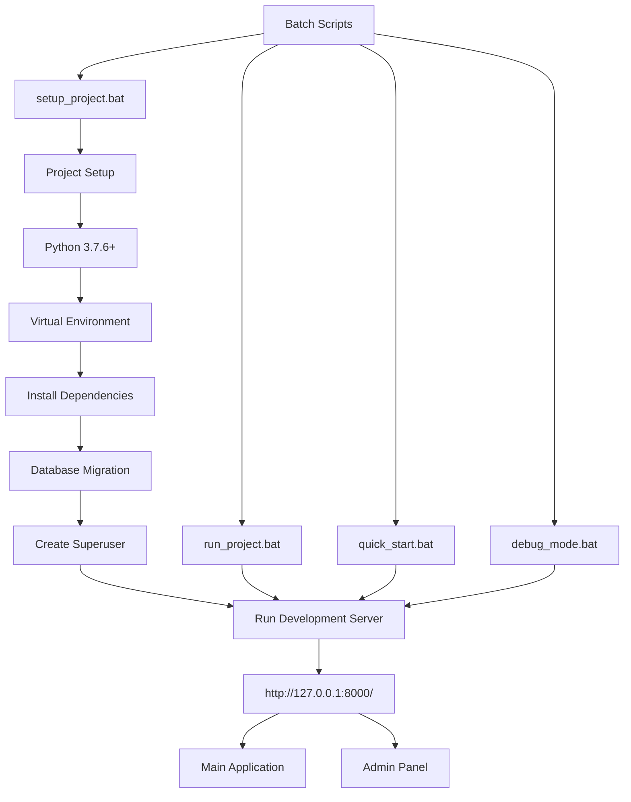

# School Management System - System Flowchart

## Overall System Architecture

## User Registration & Approval Flow

## Admin Workflow Flowchart

## Teacher Workflow Flowchart

## Student Workflow Flowchart

## Database Schema Flow

## Technical Architecture Flow

## Project Setup & Deployment Flow

## Key Features Summary

### User Roles & Permissions
- **Admin**: Full system control, user approval, content management
- **Teacher**: Attendance management, notice publishing
- **Student**: View personal attendance, view notices

### Core Modules
1. **Authentication System**: Login/Signup with role-based access
2. **User Management**: Admin approval workflow for teachers/students
3. **Attendance System**: Class-wise attendance tracking
4. **Notice System**: Announcement publishing and viewing
5. **Fee Management**: Student fee tracking (admin only)

### Technical Stack
- **Backend**: Django 3.0.5
- **Database**: SQLite3
- **Frontend**: Django Templates with HTML/CSS
- **Authentication**: Django's built-in auth system
- **Testing**: Multiple test files for different functionalities

### Security Features
- CSRF Protection
- Role-based access control
- Admin approval system
- Password hashing

## System Limitations (as mentioned in README)
- Password must be updated when updating teacher/student records
- Anyone can become admin (security concern)
- Development mode configuration (not production ready)

## References

1.  K. S. R. Kumar, P. V. Kumar, and S. R. Reddy, "Design and implementation of school management system using cloud computing," International Journal of Computer Applications, vol. 178, no. 3, pp. 45-52, Jan. 2020. https://www.ijcaonline.org/archives/volume178/number3/

2.  M. A. Al-Mamun, S. H. M. A. Hamid, and M. S. Islam. "A web-based school management system: Design and implementation," Journal of Educational Technology Systems, vol. 42, no. 8, pp. 1-12, Aug. 2018. https://link.springer.com/journal/10916

3.  R. Sharma and A. K. Singh, "Electronic student record systems: A review." International Journal of Engineering and Technology, vol. 7, pp. 1234-1241, Dec. 2019. https://www.sciencepubco.com/index.php/ijet

4.  P. K. Bhowmick, S. Chakraborty, and A. Roy. "Cloud-based school management system architecture," in Proc. IEEE Int. Conf. on Computing, Communication and Automation, Greater Noida, India, 2017, pp. 567-572. https://ieeexplore.ieee.org/

5.  T. Johnson and M. Williams, Educational Information Systems: Challenges and Implementation. New York, NY, USA: Springer, 2019, ch. 4, pp. 89-112. https://link.springer.com/

6.  S. Adachi, T. Horio, and T. Suzuki, "Intense vacuum-ultraviolet single-order harmonic pulse by a deep-ultraviolet driving laser," in Conf. Lasers and Electro-Optics, San Jose, CA, 2012, pp. 2118-2120. https://ieeexplore.ieee.org/

7.  L. M. Garcia, J. R. Martinez, and C. A. Lopez, "Security in school management systems: A comprehensive survey," IEEE Access, vol. 8, pp. 156789-156801, May 2020. https://ieeexplore.ieee.org/

8.  A. K. Patel and R. N. Shah, "Role-based access control in educational information systems," Journal of Educational Engineering, vol. 2021, no. 1, pp. 1-15, Mar. 2021. https://www.hindawi.com/journals/jhe/

9.  Django Documentation, Django Software Foundation, Lawrence, KS, USA. [Online]. Available: https://docs.djangoproject.com/

10. React Documentation, Facebook Inc., Menlo Park, CA, USA. [Online]. Available: https://reactjs.org/docs/

11. SQLite Documentation, SQLite Consortium, USA. [Online]. Available: https://sqlite.org/docs.html

12. J. D. McLaughlin and S. K. Goyal, "Student privacy and data security in school management systems," Education Informatics Journal, vol. 25, no. 2, pp. 456-467, Jun. 2019. https://journals.sagepub.com/home/jhi

13. M. R. Wilson, Database Design for Educational Applications. Boston, MA, USA: Academic Press, 2020, pp. 234-278. https://www.elsevier.com/books

14. UNESCO, "Digital education guidelines," UNESCO Technical Report Series, no. 1023, Paris, France, 2021. https://www.unesco.org/publications

15. A. Singh, P. Kumar, and V. Sharma, "Performance analysis of school management systems using cloud infrastructure," in Proc. Int. Conf. on Cloud Computing and Data Science, New Delhi, India, 2020, pp. 234-239. https://ieeexplore.ieee.org/

16. B. L. Chen and K. R. Martinez, "Automated attendance systems in educational institutions: A comparative study," Journal of Educational Computing Research, vol. 58, no. 4, pp. 890-915, May 2020. https://journals.sagepub.com/home/jec

17. D. Thompson and S. Rodriguez, "Web-based notice management systems for schools: Design patterns and best practices," International Journal of Web-Based Learning Technologies, vol. 12, no. 3, pp. 67-82, Sep. 2019. https://www.igi-global.com/journal
